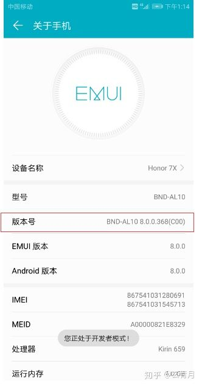
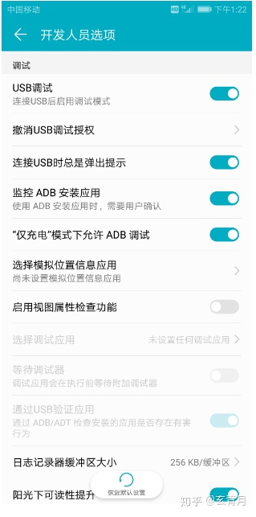
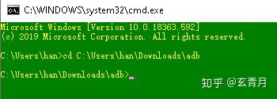
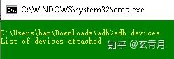
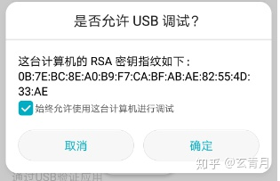
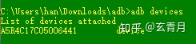

# 通过adb禁用或删除华为自带程序方法

1.  打开手机设置，点击“系统”->“关于手机”连续快速点击“版本号”，即会出现 “开发者”提示！

2.  打开手机设置，点击“系统”->“开发人员选项”，找到调试选项卡，激活“USB调试”、“连接USB时总是弹出提示”“监控ADB安装应用”、“仅充电模式下允许USB调试”

3.  进入ADB SHELL官网下载调试工具包 （ADB Kits）解压缩。adb.exe即软件主体，但是注意这个软件不能直接双击运行，必须通过命令提示符(CMD)来运行。WIN+R 打开运行窗口，输入cmd，回车，即打开cmd窗口，通过cd命令移动到刚刚解压的adb目录。

4.  输入adb devices 回车，目的是先将adb运行起来，待会插手机时手机会跳出授权窗口，注意cmd窗口不用关闭，一直开着

5.  手机通过USB线缆连接到电脑，点击仅充电，发现手机又弹出一个USB调试授权窗口，勾上始终允许，点击确定

6.  再次在cmd中运行adb devices命令，这次便会出现你的手机信息，表示连接成功。

7.  命令行操作

    1.  命令：adb shell pm list packages > list.txt（该命令为手机内所有应用列表包括已安装应用及系统预装应用）

    2.  命令：adb shell pm list packages -s -e >enabled.txt（该命令为已启用的应用文件列表）

    3.  命令：adb shell pm disable-user +软件包名（如：adb shell pm disable-user com.huawei.scenepack）关闭旅行助手

    4.  命令：adb shell pm enable +软件包名（如：adb shell pm enable com.huawei.scenepack）启用旅行助手

    5.  命令：adb shell pm disable-user com.huawei.android.hwouc 停用系统更新

    6.  命令：adb shell pm enable com.huawei.android.hwouc  重新打开系统更新

    7.  命令： adb shell pm uninstall --user 0 +软件包名（如：adb shell pm uninstall --user 0 com.android.mediacenter）删除华为自带音乐app

8.  App包名

    com.huawei.scenepack     华为旅行助手

    com.android.mediacenter  华为音乐

    com.huawei.android.thememanager 华为主题（应该是不能删除，具体没有实验过，我只是停用了，目前没发现异常）

    com.huawei.appmarket 华为应用市场（个人觉得没啥用，更习惯去官网下载）

    com.huawei.parentcontrol 学生模式（没啥大用，个人感觉）

    com.huawei.wallet  华为钱包

    com.huawei.phoneservice 华为会员服务

    com.huawei.hwpolicyservice 旅行助手服务管理 （个人感觉没啥用有耗电）

    com.baidu.input_huawei 自带华为输入法

    com.huawei.hwid 华为移动服务（禁用可能有不确定异常出现，但是真的耗电）

    com.huawei.trustspace 支付保护中心（无法禁用，重启后还会启动，同时也不建议停用或卸载）

    com.huawei.vassistant 语音助手

    com.huawei.himovie  华为视频

    com.huawei.hisuite  华为助手

    com.huawei.android.hwouc 华为系统更新 （不喜欢更新的强烈建议停用）

    com.huawei.android.hwpay 华为钱包支付防护中心

    com.huawei.powergenie 省电精灵（不建议关闭或卸载）

    com.huawei.hwapplet 旅行管理策略管理 （个人觉得比较耗电）

    com.huawei.skytone 天际通服务（没什么用，可以关闭或者不去管它就好）

    com.android.browser 华为自带浏览器（真的辣鸡）

    com.huawei.android.pushagent 推送服务（不想说）
